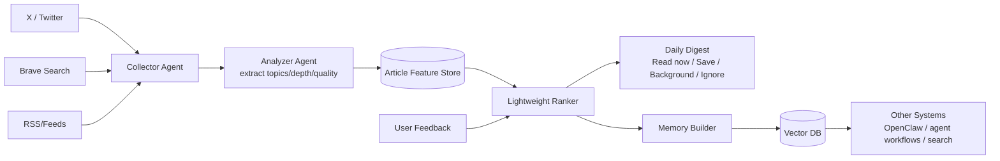
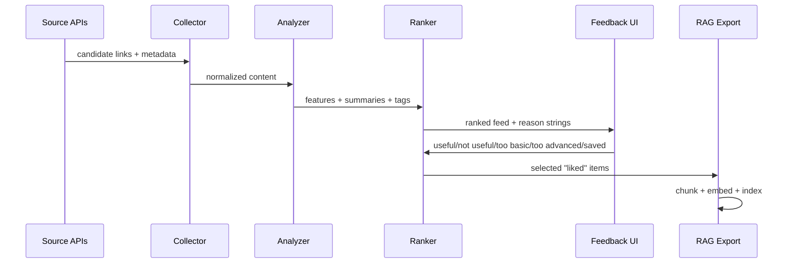

# 🐦 Second Brain Agent — Personal AI/News Relevance Engine

<p align="center">
  <strong>Train your own article feed with feedback, then export what matters into RAG memory.</strong>
</p>

<p align="center">
  
  
  
  
</p>

<p align="center">
  <a href="#why-second-brain-agent">Why</a> ·
  <a href="#lightweight-ranker-what-it-is">Lightweight Ranker</a> ·
  <a href="#system-design">System Design</a> ·
  <a href="#training-loop-feedback--learning">Training Loop</a> ·
  <a href="#rag-export-contract">RAG Export</a> ·
  <a href="#quick-start">Quick Start</a>
</p>

## Why Second Brain Agent

Second Brain Agent is a **standard recommendation system for AI + engineering news** that improves from your feedback.

It does not need direct codebase mapping to be useful.

It is built to:

- Ingest candidate items from X/Twitter, Brave, RSS, newsletters
- Rank by personal relevance and actionability
- Learn over time from explicit feedback signals
- Persist liked content as vectorized memory for downstream systems (OpenClaw, agents, internal tools)

## Lightweight Ranker (What It Is)

A lightweight ranker is a small scoring model that combines features like topic fit, depth fit, recency, and quality.

Why it is better than immediate LLM fine-tuning:

- Retrains quickly from small feedback sets
- Cheap to run for every item
- Easy to debug and explain with "why recommended"
- Handles rapidly changing interests better than slow fine-tune cycles

Current starter implementation: `src/ranker.ts`.

## System Design



## Pipeline Sequence



## Training Loop (Feedback -> Learning)

Use a three-layer learning loop:

1. Online updates (per event)
- Immediate weight adjustments from feedback events
- Implemented in `applyFeedback(...)`

2. Daily re-rank refresh
- Recompute source trust, topic affinity, depth preference, and novelty preference
- Apply recency decay and diversity constraints

3. Weekly fit pass
- Train a small pairwise ranker on your interactions (clicked/saved/revisited/cited)
- Keep the model small and interpretable

### Feedback Events

- `useful`
- `not_useful`
- `too_basic`
- `too_advanced`
- `saved`

## Agentic vs Fine-Tuning

Recommended order:

1. **Agentic ingestion + feature extraction**
2. **Lightweight learned ranker**
3. **Optional LLM fine-tuning later** (only after enough labels)

Fine-tuning is usually not the first bottleneck for recommendation quality.

## RAG Export Contract

Second Brain Agent should export selected items in a stable format:

```json
{
  "id": "article_123",
  "title": "Tool Calling Reliability in Multi-Agent Systems",
  "url": "https://example.com/post",
  "summary": "...",
  "topics": ["agentic architecture", "tools", "evals"],
  "quality_score": 0.88,
  "relevance_score": 0.91,
  "saved_at": "2026-02-11T20:00:00Z",
  "embedding": [0.012, -0.44, 0.09]
}
```

Downstream systems can query by semantic similarity + metadata filters.

## Quick Start

```bash
pnpm install
pnpm test
pnpm build
```

## Repository Layout

- `src/ranker.ts` — core lightweight ranker and feedback adaptation
- `src/types.ts` — data contracts for candidates, context, feedback, weights
- `test/ranker.test.ts` — ranking and adaptation tests

## Next Implementation Targets

1. Source adapters: X, Brave, RSS.
2. Vector layer: pgvector/LanceDB/Qdrant adapter.
3. Digest API + UI feedback surface.
4. Bandit exploration policy for discovery vs exploitation.
5. OpenClaw skill exposing `recommended.read_now` and `memory.search` tools.

## License

MIT
